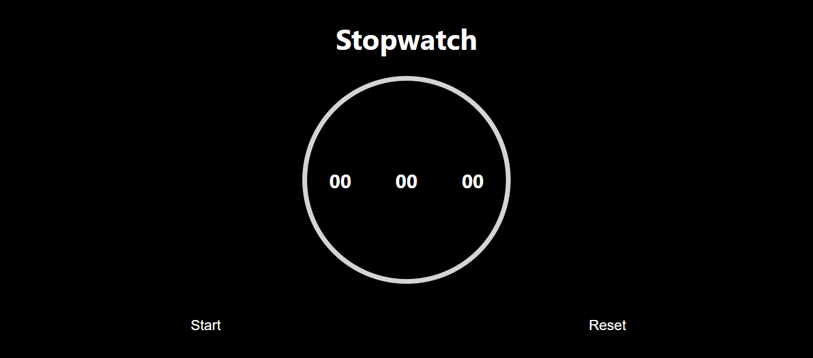

<h1>Clone of a simple stop Watch with HTML, CSS, and Vanilla Js</h1>
<h2>Functionalities</h2>

Start,Stop and Reset 

<h1>UI of the page</h1>

<h1>Working Demo</h1>
<video width="320" height="240" controls>
  <source src="./Demo.mp4" type="video/mp4">
  Your browser does not support HTML video.
</video>
